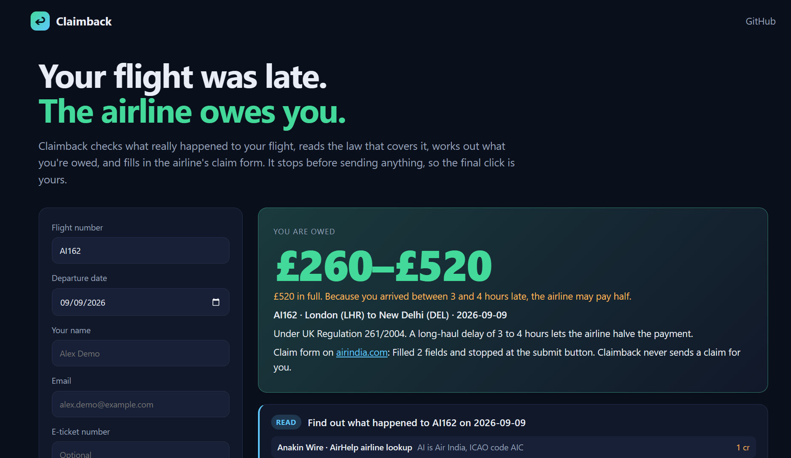
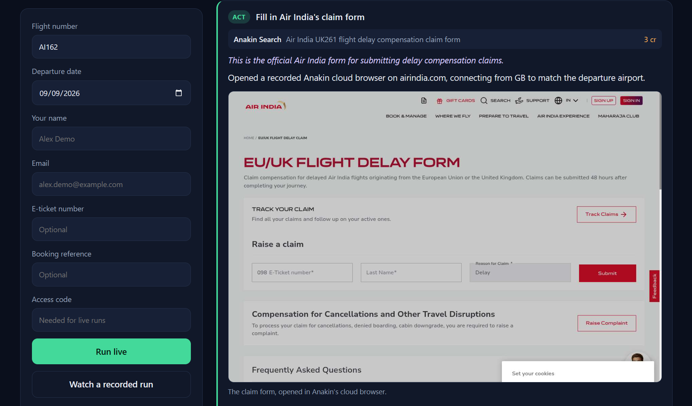
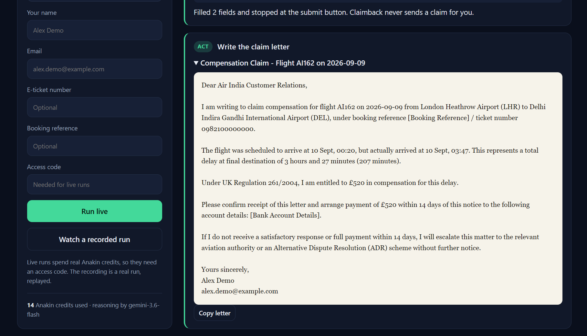
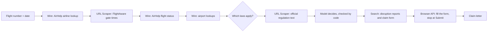

# Claimback

**Your flight was late. The airline probably owes you. Claimback works out how much and fills in the claim.**

If your flight lands three or more hours late, UK and EU rules usually mean the airline owes you money. A lot of people never claim it, and I get why. You have to dig up the real arrival time, figure out which regulation applies, and then fight your way through the airline's claim form.

Claimback does that part for you. Give it a flight number and a date. It checks what actually happened to the flight, reads the law that covers it, works out what you're owed, and fills in the airline's own claim form in a recorded cloud browser. It stops before Submit, so the last click is always yours.

I built it for **Anakin Forge 2026** on top of [Anakin](https://anakin.io)'s APIs, with OpenAI and Gemini doing the reasoning.



**Try it:** [watch a recorded run](https://claimback-kt20.onrender.com) (always on), or [start a live claim](https://claimback-live.onrender.com). Live claims need the access code, and the server takes about a minute to wake up.

**Demo video:** [watch the 3-minute walkthrough on YouTube](https://youtu.be/Qso_MPN9rk0).

## A real run

Here's what happened with **Air India AI162, London Heathrow to Delhi, on 9 September 2026**.

**Read.** FlightAware's gate times say the flight was due at 00:20 and reached the gate at 03:47, so it was 207 minutes late. AirHelp's flight status, checked separately, also says 207 minutes.

**Reason.** The flight left the UK, so UK Regulation 261/2004 applies. India's DGCA rules apply too, since Air India is an Indian airline, but they don't pay cash for delays. The route is 6,732 km. Claimback reads Article 7 on legislation.gov.uk and decides the passenger is owed £520. On a flight that long, a delay of 3 to 4 hours lets the airline pay half, so the honest answer is somewhere between £260 and £520.

**Act.** It finds Air India's own EU/UK delay claim form with Anakin Search and opens it in Anakin's cloud browser through a UK connection. It rejects the cookie banner, types in the ticket number and surname, and stops at Submit.



Then it writes a claim letter, in case you'd rather email the airline or the form doesn't work out.



A run like this takes a few minutes and about 14 Anakin credits.

## How it works



| Step | What happens | Anakin product |
|---|---|---|
| Read | Turns the airline code into its ICAO code, country and EU261 status | Wire (`act_airhelp_airline_autocomplete`) |
| Read | Gets scheduled and actual gate times for the last 14 days | URL Scraper (FlightAware) |
| Read | Gets a second, independent delay figure | Wire (`act_airhelp_flight_status_listing`) |
| Reason | Looks up airport countries and coordinates to measure the distance | Wire (`act_airhelp_airport_autocomplete`) |
| Reason | Reads the official regulation text live | URL Scraper (legislation.gov.uk, europa.eu) |
| Reason | Looks for weather, strikes or ATC problems the airline could blame | Search |
| Act | Finds the airline's own claim form | Search |
| Act | Fills it in through a connection in the departure country, recorded, stopping at Submit | Browser API |

Every decision comes back from the model as structured JSON. OpenAI answers when `OPENAI_API_KEY` is set, and Gemini steps in if OpenAI fails.

## Why you can trust the answer

An agent that helps people make legal claims can't just sound confident. It has to be right, so the model never gets the final say.

- **Two sources for the delay.** FlightAware and AirHelp are compared, and if they disagree you'll see it. Delay is measured at the gate, because that's what the law uses.
- **The airline that actually flew.** A codeshare number is traced to the airline that operated the flight, since the law and the claim follow that airline.
- **Quotes get checked.** Every sentence the model quotes from a regulation has to appear on the page it read. If it doesn't, the quote is flagged.
- **Amounts get checked.** Each decision is compared with a built-in table of EU261, UK261, Canadian and Indian rules, and the table sets the final numbers. If the regulation page or the model is down, the table still decides.
- **Sources are real.** A search result the model cites is dropped unless Anakin Search really returned it, and only normal web links are ever opened or shown.
- **It never submits.** Before the airline's page loads, Claimback switches off form submission inside it, so no click, Enter key or script can send the form. It also blocks any request that carries your ticket number, booking reference or email, and it won't click anything that submits, sends, confirms or pays. All of this is code, not a line in a prompt.
- **Problems are loud.** Missing flight times, airports without coordinates, diversions and flights older than 14 days get a clear message, never a quiet "nothing owed".

## Run it locally

You'll need Node 22 or newer, an [Anakin API key](https://anakin.io), and either an OpenAI or a [Gemini](https://aistudio.google.com/apikey) key.

```bash
npm install
cp .env.example .env    # add ANAKIN_API_KEY and OPENAI_API_KEY or GEMINI_API_KEY
npm start               # http://localhost:7860
```

You can also run a claim from the terminal:

```bash
npm run claim -- AI162 2026-09-09             # the full run, saved to runs/
npm run claim -- AI162 2026-09-09 --no-form   # skip the browser step
```

Visitors see a recorded run. Live runs spend credits, so they need the `LIVE_RUN_CODE` from `.env`. Too many wrong codes from one visitor lock them out for up to 15 minutes, and a run that goes past 15 minutes is dropped so it can't hold the only live slot.

## Tests

```bash
npm test
```

The tests don't need keys and don't spend credits, because Anakin, FlightAware and the models are all faked. They cover the compensation table, the guardrail, codeshares, bad flight data, model fallback, recording lookup, the server's input checks and limits, and the web page. The form filler tests drive a real local Chrome through pages built to trick it into sending, including a "Continue" button that quietly posts your ticket number, and they fail if anything gets out. If Chrome isn't installed those tests are skipped, and you can point `CHROME_PATH` at it.

## Deploy

`render.yaml` is a Render Blueprint. In Render, pick New > Blueprint, choose this repository and fill in the secrets. You get two free services:

- **claimback** is a static site that plays the recorded run in `public/demo/featured-run.json`. It's always on and never spends credits.
- **claimback-live** is the Node server for live claims. It needs `ANAKIN_API_KEY`, `OPENAI_API_KEY` or `GEMINI_API_KEY`, and `LIVE_RUN_CODE`. Free web services sleep when nobody's using them, so the first visit takes about a minute.

Put the live service's address in `public/site.json` so the static page can link to it. To replay a different run, use `node scripts/feature-run.js runs/<a complete run>.json`. There's also a `Dockerfile` if you'd rather use a host that runs containers.

## Project layout

| Path | What's in it |
|---|---|
| `lib/agent.js` | The Read, Reason, Act pipeline and the checks around the model |
| `lib/flight.js` | FlightAware parsing and the AirHelp Wire lookups |
| `lib/rules.js` | Which laws apply, and the reference compensation table |
| `lib/claimform.js` | The cloud browser form filler and its submit guard |
| `lib/llm.js`, `lib/openai.js`, `lib/gemini.js` | Structured model calls with fallback |
| `lib/anakin.js` | The Anakin API client |
| `server.js`, `public/` | The web app, with live runs streamed over server-sent events |
| `scripts/` | Terminal runner, replay promotion and the demo video |
| `test/` | Offline unit, server and browser tests |
| `assets/` | Screenshots for this README |

## Limits

- This is a hackathon prototype, not a service for real claims. It reads flight data from FlightAware's public pages, whose [terms](https://www.flightaware.com/about/termsofuse) only allow personal, non-automated use, and from AirHelp's flight status through Anakin Wire. A real service would need flight data from a licensed source whose terms cover compensation claims.
- FlightAware's public history only goes back about 14 days, so older flights can't be checked yet.
- Diversions and multi-leg trips aren't handled.
- Cancellations come back as "depends", because the answer hinges on how much notice you got, and flight data can't show that. India's cancellation amounts depend on block time, which Claimback estimates from distance.
- Airline forms vary a lot. If one needs a login, a captcha or a booking lookup, Claimback stops and tells you, and the letter is your fallback.
- The submit guard can't see inside binary request bodies or page navigations, so a site that sends your details that way could still get them out. Every run is recorded, so you'd see it happen.
- Claimback isn't legal advice.

## License

MIT
