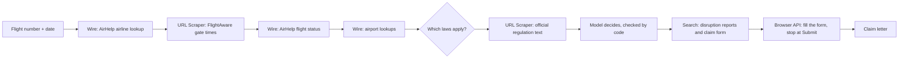

# Claimback

**Your flight was late. The airline owes you. Claimback proves it and fills in the claim.**

Millions of passengers are owed delay compensation every year and never claim it, because working out whether you qualify means digging up real arrival times, reading regulations, and fighting an airline's form. Claimback is an AI agent that does all three. Give it a flight number and a date: it reads what actually happened, reads the law that covers the flight, decides what you're owed, and fills in the airline's own claim form in a recorded cloud browser. It stops before pressing Submit, so the final click is always yours.

Built for **Anakin Forge 2026** on [Anakin](https://anakin.io), with OpenAI and Gemini for reasoning.

## A real run

**Air India AI162, London Heathrow to Delhi, 9 September 2026.**

- **Read.** FlightAware's gate times say it was due at 00:20 and reached the gate at 03:47, 207 minutes late. AirHelp's flight-status listing independently reports 207 minutes.
- **Reason.** It departed the UK, so UK Regulation 261/2004 applies. India's DGCA rules also apply to an Indian airline, but pay nothing for delays. The route is 6,732 km. Claimback reads Article 7 on legislation.gov.uk and decides the passenger is owed £520, which Air India may halve to £260 because the delay was between 3 and 4 hours.
- **Act.** It finds Air India's own EU/UK delay claim form with Anakin Search, opens it in Anakin's cloud browser through a UK connection, rejects the cookie banner, fills in the ticket number and surname, and stops at Submit. Then it writes the claim letter.

The whole run takes a few minutes and about 14 Anakin credits.

## How it works



| Phase | What happens | Anakin product |
|---|---|---|
| Read | Airline code to ICAO code, country and EU261 status | Wire (`act_airhelp_airline_autocomplete`) |
| Read | Scheduled and actual gate times for the last 14 days | URL Scraper (FlightAware) |
| Read | A second, independent delay figure | Wire (`act_airhelp_flight_status_listing`) |
| Reason | Airport countries and coordinates, great-circle distance | Wire (`act_airhelp_airport_autocomplete`) |
| Reason | The official regulation text, read live | URL Scraper (legislation.gov.uk, europa.eu) |
| Reason | Reports of weather, strikes or ATC problems the airline could cite | Search |
| Act | The airline's own claim form | Search |
| Act | Filling it in through a connection in the departure country, recorded, stopping at Submit | Browser API |

Every decision is a structured JSON answer from the model: OpenAI when `OPENAI_API_KEY` is set, with Gemini as the fallback.

## Why you can trust the answer

An agent that files legal claims has to be right, so the model is never the last word:

- **Two sources for the delay.** FlightAware and AirHelp are compared, and any disagreement is shown rather than hidden. Delay is measured at the gate, which is what the law uses.
- **Quotes are checked.** Every sentence the model cites from a regulation is matched against the page it was read from, and marked if it can't be found.
- **Amounts are checked.** Each decision is compared with a built-in table of EU261, UK261, Canadian and Indian rules. The table sets the final figures, and any disagreement is shown.
- **Sources are real.** A search result the model cites is dropped unless Anakin Search actually returned it.
- **It never submits.** Buttons that submit, send, confirm or pay are blocked in code, not just in the prompt.
- **Failures are loud.** Missing flight data, diversions and flights older than 14 days produce a clear message, never a quiet "nothing owed".

## Run it locally

Needs Node 20+, an [Anakin API key](https://anakin.io), and an OpenAI or [Gemini](https://aistudio.google.com/apikey) key.

```bash
npm install
cp .env.example .env    # add ANAKIN_API_KEY and OPENAI_API_KEY or GEMINI_API_KEY
npm start               # http://localhost:7860
```

From the terminal:

```bash
npm run claim -- AI162 2026-09-09             # the full run, saved to runs/
npm run claim -- AI162 2026-09-09 --no-form   # skip the browser step
```

Every visitor sees a recorded run. Live runs spend credits, so they need the `LIVE_RUN_CODE` from `.env`.

## Deploy

`render.yaml` is a Render Blueprint. In Render, choose New > Blueprint, pick this repository, and fill in the secrets. It creates two free services:

- **claimback**, a static site that plays the recorded run in `public/demo/featured-run.json`. It is always on and spends no credits.
- **claimback-live**, the Node server for live claims. It needs `ANAKIN_API_KEY`, `OPENAI_API_KEY` or `GEMINI_API_KEY`, and `LIVE_RUN_CODE`. Free web services sleep when idle, so the first visit takes about a minute.

Put the live service's address in `public/site.json` so the static page links to it. To replay a different run, use `node scripts/feature-run.js runs/<a complete run>.json`. A `Dockerfile` is included for hosts that run containers.

## Project layout

| Path | What it is |
|---|---|
| `lib/agent.js` | The Read, Reason, Act pipeline and the checks around the model |
| `lib/flight.js` | FlightAware parsing and the AirHelp Wire lookups |
| `lib/rules.js` | Which laws apply, and the reference compensation table |
| `lib/claimform.js` | The cloud-browser form filler and its submit guard |
| `lib/llm.js`, `lib/openai.js`, `lib/gemini.js` | Structured model calls with fallback |
| `lib/anakin.js` | The Anakin API client |
| `server.js`, `public/` | The web app, with live runs streamed over server-sent events |
| `scripts/` | Terminal runner, replay promotion, demo video |

## Limits

- FlightAware's public history covers about 14 days, so older flights can't be checked yet.
- Diversions and multi-leg journeys aren't handled.
- Cancellation claims depend on how much notice was given, which flight data can't show, so they come back as "depends".
- Airline forms vary. When one needs a login, a captcha or a booking lookup, Claimback stops and says so, and the claim letter is the fallback.
- Claimback is not legal advice.

## License

MIT
